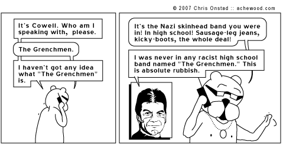

# Grenchman

Fast invocation of Clojure code over nREPL.

<a href="http://achewood.com/index.php?date=04022007">
  </a>

## Install

You will need to install [opam](http://opam.ocamlpro.com/) and OCaml 4.x to be
able to build Grenchman.

If you're not sure whether you have 4.x installed or not, you can ensure
yourself as follows:

    $ opam switch list
    # If your system compiler is 4.x or above, you're ready to go.
    # Otherwise, issue the following command:
    $ opam switch 4.00.1

To build, run the following commands:

    $ git clone git@github.com:technomancy/grenchman.git grenchman
    $ cd grenchman
    $ opam install core async ocamlfind
    $ ocamlbuild -use-ocamlfind grench.native
    $ ln -s $PWD/grench.native ~/bin/grench # or somewhere on your $PATH

## Usage

You can use `grench` as a replacement for the `lein` script for most
tasks, with some gotchas listed below.

Currently it requires Leiningen from git master (newer than 2.3.2). It's
up to you to launch your own Leiningen process separately:

    $ cd ~/.lein && lein repl :headless

You may find this snippet useful to put in your user profile to
quickly eval one expression at a time:

```clj
:aliases {"eval" ["run" "-m" "clojure.main/main" "-e"]}
```

## Faster

Using Grenchman means you never have to wait for Leiningen's JVM to
start, but project JVMs are still launched like normal by default for
most task invocations. In order to avoid that, you can run `lein repl`
(with or without `:headless`) inside the project directory and
`grench` will automatically route `eval-in-project` calls to that
running repl instance.

Then you can run things like:

    $ time grench eval '(:status (my.web/app {:uri "/"}))'
    200

    real    0m0.651s
    user    0m0.024s
    sys     0m0.024s

## Gotchas

The `repl` task is currently replaced with a dumbed-down raw
`clojure.main` repl which lacks all the pleasantries of modern
civilization like input history and readline bindings. Wrapping with
`rlwrap` is recommended. It is also affected by a bug in Leiningen
which prevents it from working inside a project directory unless the
in-project repl server technique above is used.

Tasks for all projects will share the same Leiningen instance, so
projects with have conflicting plugins or hooks may behave unpredictably.

## License

Copyright © 2013 Phil Hagelberg. Bencode implementation by Prashanth
Mundkur. Licensed under the GNU General Public License, version 3 or
later. See COPYING for details.
